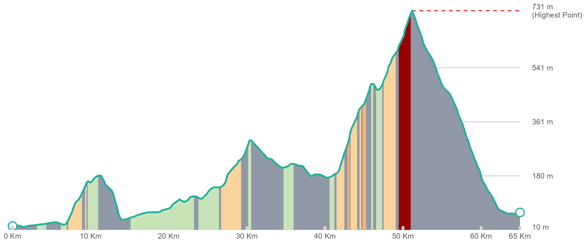

# Cycling plots

**This hobby project is still work in progress**

### Description

Here's how to make beautiful cycling height profiles. Like this one!


and this one:


or make a nice map plotting the route in a leaflet map:


### Usage in short:

* This repository contains two R code snippets containing functions to make:
    + An elevation profile based on any gpx file
    + A map displaying the route in a leaflet map (with JAWG-lagoon base layer)
* The sf package is used to uniformly import the gpx files.
* Rolling averages are calculated with the zoo package
* For now, elevation is needed as a variable in the gpx files, later support for gpx files without elevation will be added.
* Future plans involve a shiny app allowing you to upload a .gpx file and generate the two images.  
 
### Arguments for `elevationprofile()`

- `data_input`: This argument will accept either a filepath or a dataframe (e.g., `"C:/data/route.gpx"`). Dataframes need the following variables:
  -'distance_total'
  -'ele' 
  -'avggradient'
- `seg`: The distance in meters over which to calculate the gradient. *Default: `1000` (i.e., 1 km segments)*
- `fixed_breaks`: A numeric value to set a fixed distance for x-axis labels (e.g., `5000` for labels every 5 km). If `NULL`, breaks are determined automatically. *Default: `NULL`*
- `colorscalestr`: A vector of 6 hex color codes for the gradient levels, from downhill/flat to steepest uphill. *Default: `c("#9198A7", "#C9E3B9", "#F9D49D", "#F7B175", "#F47D85", "#990000")`*
- `linecolor`: The color of the elevation profile line. *Default: `"#22678A"`*
- `maxlinecol`: The color of the horizontal line indicating the maximum elevation. *Default: `"red"`*
- `transparency`: The transparency of the colored area under the curve representing the gradient. *Default: `1` (fully opaque)*
- `plotsave`: Logical (`TRUE`/`FALSE`). If `TRUE`, the plot is saved to disk. *Default: `FALSE`*
- `plotsavedir`: The directory where the plot will be saved. If `NULL`, it saves to the current working directory. *Default: `NULL`*
- `plotname`: The file name for the saved plot. If left empty, the name is generated from the GPX file name. *Default: `""`*
- `ggsave_width`: The width of the saved plot. *Default: `24`*
- `ggsave_height`: The height of the saved plot. *Default: `10`*
- `ggsave_dpi`: The resolution (dots per inch) of the saved plot. *Default: `300`*
- `ggsave_units`: The units for width and height (`"cm"`, `"in"`, or `"mm"`). *Default: `"cm"`*
- `ggsave_background`: The background color of the saved plot. Use `"transparent"` for a clear background. *Default: `"transparent"`*
- `mingraddist`: The minimum distance in meters to consider for elevation changes, used for GPS jitter correction. *Default: `5`*
- `textsize`: The base text size for labels and titles on the plot. *Default: `60`*

### Details
6 levels have been set as categories for the area under the curve colors, based on the following grade categories:
  + downhill or flat
  + gradient "<3%"
  + gradient "3-6%"
  + gradient "6-9%"
  + gradient "9-12%"
  + gradient ">12%"
  
Colors of these gradient levels can be adjusted with `colorscalestr` by providing a with sting 6 hex colors. (example: `c("#9198A7","#C9E3B9", "#F9D49D", "#F7B175", "#F47D85", "#990000")`)

For `gpxrolling`, smaller numbers will  make the plot more detailed (smaller facets), but note that the plotting will take longer. For example, if a gpx file only contains a climb of 2500 geometry points, and the rolling average will be set to 2500, then the gradient calculated will just be the gradient for the full climb, hence the plot will only contain one facet. 

### Note

#### Examples

```{r elevation-plot, dev='png',message=FALSE}
elevationprofile("gpx/crazy ride.gpx") # simple use, using standard presets 

  elevationprofile(gpx/crazy ride.gpx,
                   seg=2000,
                   fixed_breaks=7.5,
                   mingraddist=2.5,
                   colorscalestr=c("lightblue","lightgreen", "green", "pink", "orange", "darkred"),
                   linecolor="red",
                   maxlinecol="darkblue",
                   transparency=.7,
                   plotsave=T,
                   plotsavedir="~/cyclingplots/images",
                   plotname="Steep steeper steepst",
                   ggsave_width=24,
                   ggsave_height=10,
                   ggsave_dpi=300,
                   ggsave_units="cm",
                   ggsave_background="transparent")
                  
```


#### Future planning, for current functions:
- add support for gpx files without elevation values
- option to hide elevation lines
- fix order of horizontal elevation lines
- create a shiny app of both functions
- generate a package based on both function

#### Idea's:
- provide a historical overview of weather along the route or include a forcast for the next few days. 

  


